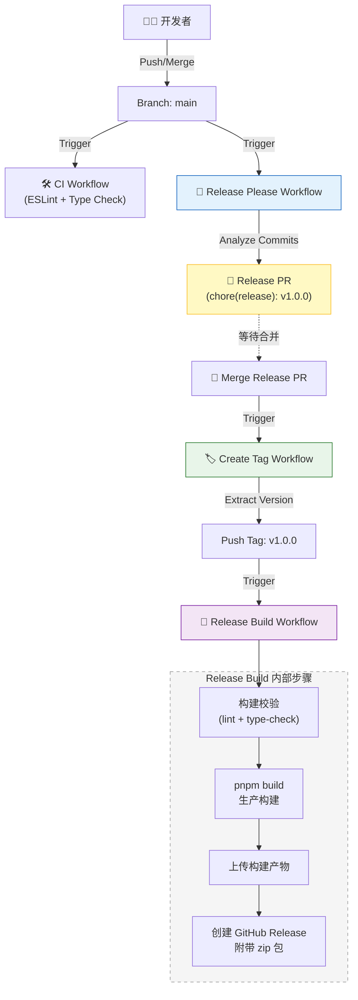

# 🤖 自动化工作流与发布机制

本项目采用全自动化的 CI/CD 流程，基于 GitHub Actions 和 Release Please 实现。本文档说明各个工作流的运作逻辑、交互关系及最佳实践。

## 🔄 工作流概览

项目包含以下核心工作流：

| 工作流文件 | 触发条件 | 职责 |
|:---|:---|:---|
| `ci.yml` | Push, PR | **持续集成**：代码格式检查 (ESLint)、类型检查、单元测试。 |
| `release-please.yml` | Push to `main` | **发布提案**：分析 Commit 信息，自动更新 `CHANGELOG.md` 和 `package.json`，生成 Release PR。 |
| `create-tag.yml` | Release PR 合并后 | **版本打标**：监听 Release Please PR 的合并，自动创建并推送 Git Tag (如 `v1.0.0`)。 |
| `release.yml` | Tag 推送 (`v*`) | **正式发布**：pnpm 构建生产包、创建 GitHub Release（含构建产物 zip）。 |
| `sync-labels.yml` | 手动触发 | **标签同步**：同步 GitHub Issue/PR 的标签配置。 |

## 🧩 自动化发布闭环逻辑

本项目实现了从代码合并到版本发布的完整闭环，无需人工干预版本号和 Tag。



### 详细流转过程

1. **提交代码**：开发者遵循 [Conventional Commits](https://www.conventionalcommits.org/) 规范提交代码。

2. **生成提案**：`release-please` 机器人分析 commit 记录。
   - 如果有 `feat` 提交，建议升级 Minor 版本 (1.0.0 -> 1.1.0)。
   - 如果有 `fix` 提交，建议升级 Patch 版本 (1.0.0 -> 1.0.1)。
   - 机器人创建一个 Release PR，包含：
     - 更新后的 `CHANGELOG.md`
     - 更新后的 `.release-please-manifest.json`
     - **更新后的 `package.json` (version 字段)**

3. **合并发布**：维护者 Review 并合并 Release PR。

4. **自动打标**：`create-tag` 工作流检测到 Release PR 被合并，提取版本号，使用 `RELEASE_TOKEN` (PAT) 推送 Git Tag。
   - *注意：必须使用 PAT 推送 Tag 才能触发后续的 GitHub Actions。*

5. **构建产物**：`release` 工作流被 Tag 触发：
   - 执行 ESLint 和 TypeScript 类型检查。
   - 执行 `pnpm build` 生成生产构建。
   - 从 `CHANGELOG.md` 提取并美化 Release Notes。
   - 将 `dist/` 目录打包为 zip 文件。
   - 创建 GitHub Release 并上传构建产物。

## 📁 配置文件

| 文件路径 | 用途 |
|:---|:---|
| `.github/release-please-config.json` | Release Please 主配置（版本类型、changelog 格式等） |
| `.github/.release-please-manifest.json` | 当前版本追踪（由 Release Please 自动维护） |
| `.github/workflows/*.yml` | GitHub Actions 工作流定义 |

### Release Please 配置示例

```json
{
  "$schema": "https://raw.githubusercontent.com/googleapis/release-please/main/schemas/config.json",
  "packages": {
    ".": {
      "release-type": "node",
      "changelog-path": "CHANGELOG.md",
      "include-v-in-tag": true,
      "changelog-sections": [
        { "type": "feat", "section": "✨ Features" },
        { "type": "fix", "section": "🐛 Bug Fixes" },
        { "type": "docs", "section": "📝 Documentation" },
        { "type": "refactor", "section": "♻️ Code Refactoring" },
        { "type": "perf", "section": "⚡ Performance Improvements" }
      ]
    }
  }
}
```

## ✅ 最佳实践

### 1. 提交规范 (Commit Convention)

这是自动化发布的基石。请务必遵循以下格式：

| 类型 | 说明 | 版本影响 |
|:---|:---|:---|
| `feat: add dark mode toggle` | 新功能 | **Minor** (1.0.0 → 1.1.0) |
| `fix: resolve routing issue` | Bug 修复 | **Patch** (1.0.0 → 1.0.1) |
| `perf: optimize bundle size` | 性能优化 | **Patch** |
| `docs: update README` | 文档更新 | **No Release** |
| `chore: update dependencies` | 杂项 | **No Release** |
| `refactor: restructure components` | 重构 | **No Release** |

**Breaking Change 示例**：

```text
feat: rewrite authentication module

BREAKING CHANGE: The login API now requires a different payload structure.
```

→ **Major** (1.0.0 → 2.0.0)

### 2. Token 配置

为了让工作流能够相互触发（Chain Reaction），需要配置 Personal Access Token (PAT)。

| 配置项 | 值 |
|:---|:---|
| **Secret Name** | `RELEASE_TOKEN` |
| **Permissions** | `contents: write` |
| **位置** | Repository Settings → Secrets → Actions |

> ⚠️ **重要**：GitHub 默认的 `GITHUB_TOKEN` 推送的 Tag **不会** 触发其他 Workflow，以防止无限递归。使用 PAT 可以绕过此限制。

#### 创建 PAT 步骤

1. 前往 GitHub Settings → Developer settings → Personal access tokens → Fine-grained tokens
2. 点击 "Generate new token"
3. 设置 Token 名称（如 `RELEASE_TOKEN`）
4. 选择仓库范围
5. 权限设置：`Contents: Read and write`
6. 生成并复制 Token
7. 在仓库 Settings → Secrets and variables → Actions 中添加 `RELEASE_TOKEN`

### 3. Node.js 版本管理

本项目使用 `release-type: "node"`，Release Please 会自动更新 `package.json` 中的 `version` 字段。

- **开发期**：正常进行功能开发，无需手动修改版本号。
- **发布期**：Release Please 自动更新版本号并生成 Release PR。

### 4. 处理发布故障

#### 场景 1：`create-tag` 成功但 `release` 失败

如果构建失败（如 ESLint 错误、TypeScript 错误）：

1. 在本地修复构建问题并推送到 `main`。
2. **手动删除** 远程和本地的 Git Tag：
   ```bash
   # 删除远程 tag
   git push origin --delete v1.0.0
   # 删除本地 tag
   git tag -d v1.0.0
   ```
3. 手动触发 `create-tag` 工作流重新创建 Tag。

#### 场景 2：Release PR 合并后未触发 Tag 创建

1. 检查 `RELEASE_TOKEN` 是否正确配置。
2. 手动触发 `create-tag` 工作流（支持 `workflow_dispatch`）。

#### 场景 3：需要跳过某次发布

如果 Release PR 中的某些变更不应发布：

1. 关闭（不合并）当前的 Release PR。
2. 使用 `chore:` 或 `docs:` 前缀提交后续修改。
3. Release Please 会重新生成合适的 Release PR。

## 🔧 本地开发命令

```bash
# 安装依赖
pnpm install

# 开发服务器
pnpm dev

# 代码检查
pnpm lint
pnpm lint:fix

# 类型检查
pnpm type-check

# 生产构建
pnpm build

# 运行测试
pnpm test
```

## 📚 相关文档

- [Conventional Commits 规范](https://www.conventionalcommits.org/)
- [Release Please 文档](https://github.com/googleapis/release-please)
- [GitHub Actions 文档](https://docs.github.com/en/actions)
