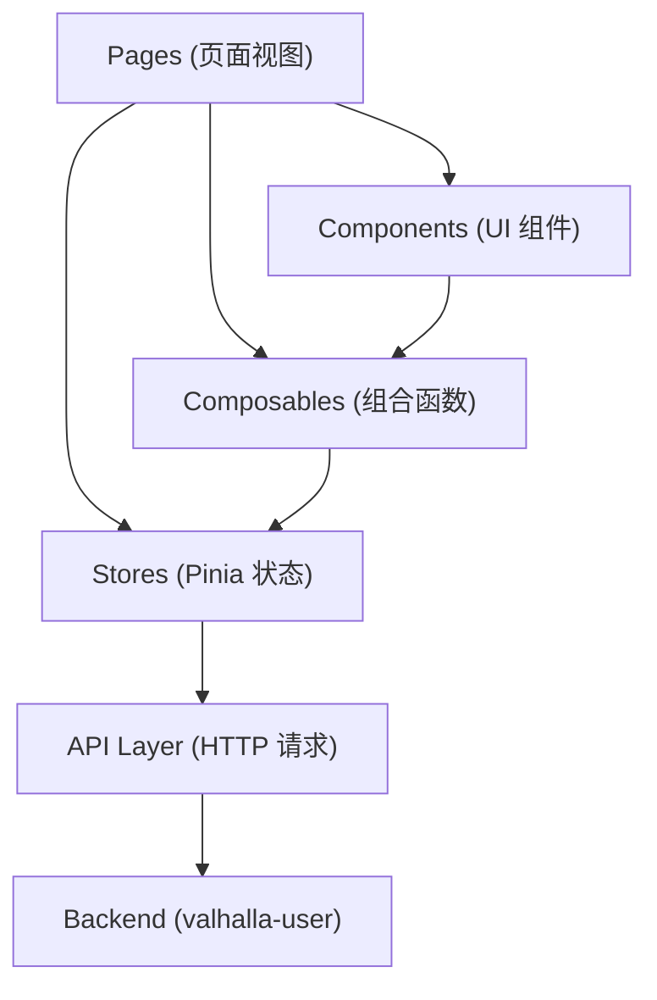

# ARCHITECTURE.md

<!--!
  长期稳定架构约束——系统边界、分层、核心依赖方向。
  修改本文件应走独立的架构 RFC（docs/design-docs/arch-*.md）。
  智能体在开始任何编码任务前应先阅读此文件。
-->

## 系统概述

Valhalla User Admin 是用户管理后台的前端应用，为管理员提供用户、角色、权限和 API 资源的可视化管理面板。它是 Valhalla 用户体系的运营入口，消费 valhalla-user 后端提供的 REST API。

技术选型以 Vue 3 Composition API + TypeScript 为核心，使用 Naive UI 组件库、Pinia 状态管理、Vue Router 文件系统路由，配合 Vite 7 构建。支持 i18n 国际化（中/英），通过 Docker + Nginx 部署为静态资源服务，支持运行时环境变量注入实现同一镜像多环境复用。

## 项目结构

```
project-root/
├── src/
│   ├── api/                # HTTP 请求层（Axios 封装 + 模块化接口）
│   │   ├── http.ts         # HTTP 方法封装类
│   │   ├── request.ts      # Axios 实例、拦截器配置
│   │   └── modules/        # 按领域拆分的 API 模块（user/role/permission/api）
│   ├── assets/scss/        # 全局样式（Sass 变量、混入、基础样式）
│   ├── components/         # 可复用 UI 组件（按功能分类）
│   │   ├── common/         # 通用原子组件（Card, ActionButtons）
│   │   ├── data-display/   # 数据展示组件（StatCard, StatusBadge）
│   │   ├── feedback/       # 反馈状态组件（Loading/Empty/Error State）
│   │   ├── form/           # 表单组件（SearchBar）
│   │   ├── layout/         # 布局组件（PageHeader, PageContainer）
│   │   ├── DataTable/      # 通用数据表格
│   │   ├── FormDialog/     # 通用表单弹窗
│   │   ├── BindingDialog/  # 绑定关系弹窗
│   │   ├── StatusSwitch/   # 状态切换开关
│   │   ├── Navbar/         # 顶部导航栏
│   │   └── Sidebar/        # 侧边栏导航
│   ├── composables/        # 组合函数（useI18n, useStores, useTheme）
│   ├── config/             # 应用配置（环境变量解析、运行时配置）
│   ├── constants/          # 常量定义（storage keys 等）
│   ├── locales/            # 国际化资源（zh-CN/en-US JSON + 配置）
│   ├── pages/              # 页面视图（文件系统路由，unplugin-vue-router）
│   │   ├── index.vue       # 首页/Dashboard
│   │   ├── user/           # 用户管理页面
│   │   ├── role/           # 角色管理页面
│   │   ├── permission/     # 权限管理页面
│   │   └── api/            # API 资源管理页面
│   ├── router/             # 路由配置（createWebHistory，auto-routes）
│   ├── stores/             # Pinia Store（user store + 持久化配置）
│   ├── types/              # TypeScript 类型定义
│   │   ├── api/            # API 响应类型
│   │   ├── store/          # Store 相关类型（user/role/permission/api/binding）
│   │   └── *.d.ts          # 自动生成的类型声明（auto-imports/components/router）
│   ├── utils/              # 工具函数（initApp 等）
│   ├── App.vue             # 根组件（Navbar + Sidebar + RouterView 布局）
│   └── main.ts             # 应用入口（Pinia → Router → i18n → mount）
├── tests/
│   ├── e2e/                # Playwright E2E 测试（Page Object 模式）
│   ├── unit/               # Vitest 单元测试（components/composables/stores/utils）
│   ├── mocks/              # 公共 mock（API/Store/Components）
│   ├── setup/              # 测试环境配置（unit/integration/e2e setup files）
│   └── utils/              # 测试辅助函数
├── public/
│   └── config.js           # 运行时配置注入点（window.__APP_RUNTIME_CONFIG__）
├── Dockerfile              # 多阶段构建（Node 22 build → Nginx 运行）
├── nginx.conf              # Nginx SPA 配置
├── entrypoint.sh           # Docker 启动脚本（环境变量 → config.js 生成）
└── vite.config.ts          # Vite 配置（插件、代理、构建优化）
```

## 分层模型



**依赖规则：**

- Pages 可使用 Components、Composables、Stores，不直接调用 API
- Components 是纯 UI 层，通过 props/emits 通信，不直接依赖 Stores
- Stores 是唯一的 API 消费者，管理异步状态和缓存
- API 层只负责 HTTP 通信，不包含业务逻辑
- 横切关注点（i18n、主题、环境配置）通过 composables 统一提供

## 技术栈

| 层级        | 技术                                            | 版本/备注                        |
| ----------- | ----------------------------------------------- | -------------------------------- |
| 框架        | Vue 3 (Composition API)                         | ^3.5.39                          |
| 语言        | TypeScript                                      | ~5.9.3                           |
| 构建        | Vite 7                                          | ^7.3.5                           |
| UI 库       | Naive UI                                        | ^2.44.1                          |
| 状态管理    | Pinia + pinia-plugin-persistedstate             | ^3.0.4 / ^4.7.1                  |
| 路由        | Vue Router + unplugin-vue-router                | ^4.6.4 / ^0.19.2（文件系统路由） |
| 国际化      | Vue I18n                                        | ^11.4.6                          |
| HTTP        | Axios                                           | ^1.18.1                          |
| 工具库      | @vueuse/core                                    | ^14.3.0                          |
| 样式        | Sass (SCSS)                                     | ^1.101.0                         |
| CSS Reset   | modern-normalize                                | ^3.0.1                           |
| 单元测试    | Vitest + @testing-library/vue + @vue/test-utils | ^4.1.10                          |
| E2E 测试    | Playwright                                      | ^1.61.1                          |
| 代码检查    | ESLint                                          | ^9.39.2                          |
| ESLint 配置 | @antfu/eslint-config                            | ^9.1.0                           |
| 包管理      | pnpm                                            | 10.28.1                          |
| 运行时      | Node.js ≥22.14.0（构建）/ Nginx（部署）         |                                  |
| CI/CD       | GitHub Actions + Release Please                 |                                  |

## 模块职责

| 模块               | 职责                                             | 依赖                            |
| ------------------ | ------------------------------------------------ | ------------------------------- |
| `src/api/`         | HTTP 通信封装，Axios 实例配置，请求/响应拦截     | axios, config/env               |
| `src/api/modules/` | 按领域拆分的 REST API 调用函数                   | api/http                        |
| `src/components/`  | 可复用 UI 组件，props-in/emits-out 设计          | naive-ui, composables           |
| `src/composables/` | 组合函数：i18n 辅助、store 快捷访问、主题切换    | stores, vue-i18n, @vueuse       |
| `src/config/`      | 环境变量解析，运行时配置（支持 Docker 注入覆盖） | vite env                        |
| `src/constants/`   | 应用常量（localStorage keys 等）                 | 无                              |
| `src/locales/`     | 国际化配置和翻译资源（zh-CN/en-US）              | vue-i18n                        |
| `src/pages/`       | 页面级视图，由 unplugin-vue-router 自动生成路由  | components, stores, composables |
| `src/router/`      | Vue Router 实例配置，路由守卫                    | vue-router, auto-routes         |
| `src/stores/`      | Pinia Store 定义，状态管理与持久化               | pinia, api/modules              |
| `src/types/`       | TypeScript 类型定义（API 响应、Store 状态等）    | 无                              |
| `src/utils/`       | 工具函数（应用初始化、页面标题管理）             | config, @vueuse                 |
| `tests/`           | 测试体系：单元（Vitest）+ E2E（Playwright）      | vitest, @playwright/test        |

## 关键架构决策

详见 [`docs/design-docs/`](./docs/design-docs/)。
