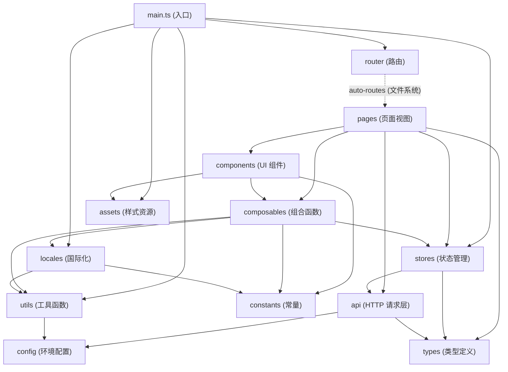

# 模块依赖图

<!-- ⚠️ 本文件由脚本自动生成，请勿手动编辑 -->

Last generated: 2026-07-12

## 概述

本文档描述 `src/` 下各一级模块之间的依赖关系。依赖通过 TypeScript/Vue import 语句分析得出。

## 模块依赖图

## 模块依赖明细

| 模块 | 依赖模块 | 依赖类型 |
|------|----------|----------|
| `main.ts` | `locales` | 直接导入（i18n 实例注册） |
| `main.ts` | `router` | 直接导入（路由注册） |
| `main.ts` | `stores/pinia` | 直接导入（Pinia 创建注册） |
| `main.ts` | `utils` | 直接导入（initAppSettings 初始化） |
| `main.ts` | `assets/scss` | 样式导入（全局样式） |
| `pages` | `components` | 直接导入（UI 组件渲染） |
| `pages` | `composables` | 直接导入（useI18nHelper 等组合函数） |
| `pages` | `stores` | 直接导入（useUserStore 状态访问） |
| `pages` | `api/modules` | 直接导入（CRUD API 函数调用） |
| `pages` | `types` | 类型导入（Store/API 类型引用） |
| `components` | `composables` | 直接导入（组合函数消费） |
| `components` | `constants` | 直接导入（STORAGE_KEYS 等常量） |
| `components` | `assets/scss` | 样式导入（SCSS 变量和 mixin） |
| `composables` | `stores` | 直接导入（useUserStore 封装） |
| `composables` | `locales` | 直接导入（i18n 配置和 setLocale） |
| `composables` | `constants` | 直接导入（STORAGE_KEYS） |
| `composables` | `utils` | 直接导入（updatePageTitle） |
| `stores` | `api/modules` | 直接导入（API 函数调用） |
| `stores` | `types` | 类型导入（Store 状态类型） |
| `api/http` | `api/request` | 直接导入（Axios 实例封装） |
| `api/request` | `config` | 直接导入（env.API_BASE_URL） |
| `api/request` | `types` | 类型导入（ApiResponse） |
| `api/modules` | `api/http` | 直接导入（Http 类方法调用） |
| `api/modules` | `types` | 类型导入（请求/响应类型） |
| `locales/i18n` | `constants` | 直接导入（STORAGE_KEYS.LOCALE） |
| `locales/i18n` | `utils` | 直接导入（updateLanguageAttribute） |
| `locales/i18n` | `locales/config` | 直接导入（语言配置常量） |
| `utils/initApp` | `config` | 直接导入（env 对象） |
| `router` | `pages` | 隐式依赖（unplugin-vue-router 文件系统路由） |
| `config` | — | 无内部模块依赖（读取 Vite env + window 运行时配置） |
| `constants` | — | 无内部模块依赖（纯常量定义） |
| `types` | — | 无内部模块依赖（纯类型定义） |
| `assets` | — | 无内部模块依赖（纯样式资源） |

## 模块职责说明

| 模块 | 职责 | 对外导出 |
|------|------|----------|
| `main.ts` | 应用入口，插件注册和挂载 | — |
| `pages/` | 页面级视图（文件系统路由自动注册） | Vue SFC 页面组件 |
| `components/` | 可复用 UI 组件（props-in / emits-out） | 20+ 命名导出组件 |
| `composables/` | Vue 组合函数（useI18nHelper, useStores, useTheme） | 组合函数 |
| `stores/` | Pinia 状态管理（useUserStore + 持久化） | Store 实例 |
| `api/` | HTTP 通信层（Axios 封装 + 按领域分模块） | API 调用函数 |
| `config/` | 环境变量解析（三层优先级） | `env` 对象 + 布尔判断 |
| `locales/` | 国际化（vue-i18n + 懒加载语言包） | i18n 实例 + setLocale |
| `constants/` | 应用常量（localStorage key 等） | 常量对象 |
| `types/` | TypeScript 类型定义（API 响应 / Store 状态） | 类型导出 |
| `utils/` | 工具函数（应用初始化、页面标题） | 工具函数 |
| `router/` | Vue Router 实例（createWebHistory + auto-routes） | router 实例 |
| `assets/` | 全局样式（SCSS 变量、mixin、reset） | SCSS 文件 |

## 架构约束

依据 `ARCHITECTURE.md` 定义的依赖规则：

- ✅ Pages → Components、Composables、Stores（正确）
- ⚠️ Pages → API modules（当前实现直接调用 API，架构文档要求 Stores 是唯一 API 消费者）
- ✅ Components 通过 props/emits 通信，不直接依赖 Stores
- ✅ Stores 是主要的 API 消费者
- ✅ API 层只负责 HTTP 通信，不包含业务逻辑
- ✅ 横切关注点（i18n、主题、环境配置）通过 composables 统一提供
